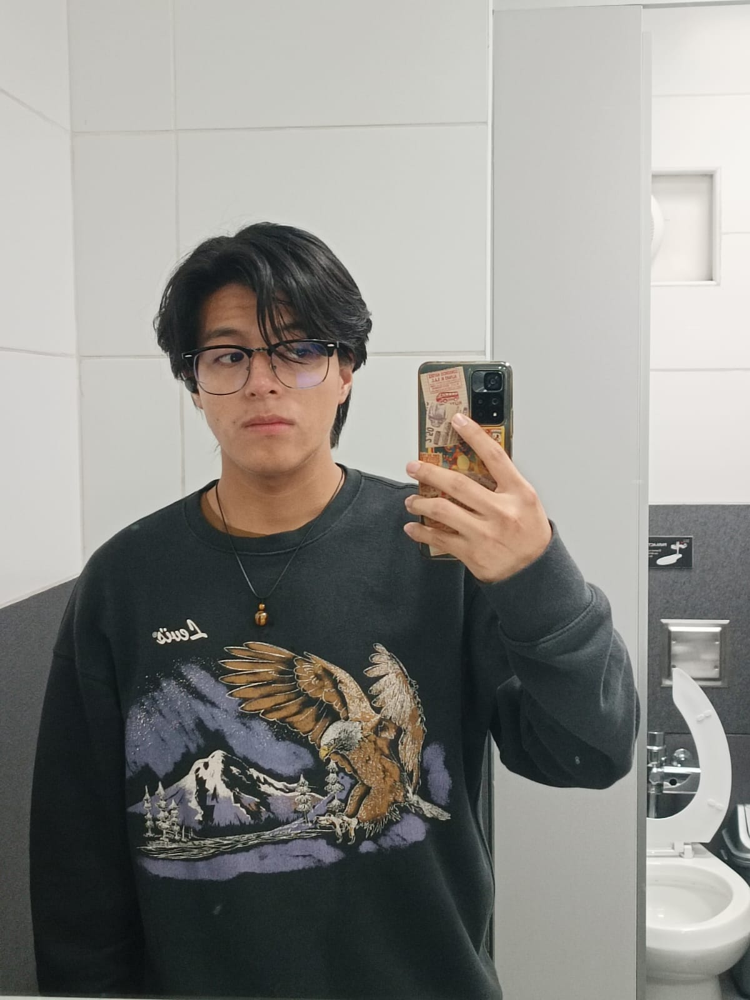

# Introducción

## 1.1 Startup Profile

### 1.1.1. Descripción de la StartUp

Somos **Scripters**, un grupo de estudiantes de la carrera de Ingeniería de Software de la UPC, desarrolladores de Regula, una aplicación web diseñada para optimizar la gestión operativa en empresas envasadoras de balones de gas. Regula busca mejorar procesos clave como la distribución, el registro de entradas y salidas, y reforzar la seguridad en almacenes tanto de las empresas como de sus distribuidores, integrando tecnologías modernas como IoT y monitoreo en tiempo real en entornos abiertos.

Actualmente, estas empresas enfrentan problemas como la falta de control preciso en el registro de balones, pérdidas económicas por fugas o mala gestión, baja visibilidad del estado de los almacenes, procesos manuales ineficientes y riesgos de seguridad por ausencia de monitoreo constante. Frente a ello, Regula propone una solución digital que integra sensores IoT en zonas de almacenamiento de balones para detectar fugas de gas en el área, junto con una plataforma web que permite registrar operaciones, monitorear condiciones en tiempo real, gestionar la distribución de balones y generar alertas ante posibles riesgos por fugas de gas. Esto facilita la centralización de la información, mejora la toma de decisiones y reduce la dependencia de procesos manuales para tener información precisa.

La propuesta de valor de Regula se basa en optimizar los procesos logísticos, mejorar la seguridad operativa, reducir pérdidas económicas y digitalizar el control de inventario y datos de distribución en un solo sistema accesible y escalable. Está dirigida principalmente a empresas envasadoras de balones de gas, distribuidores y/o centros de almacenamiento. El producto se compone de una aplicación web con dashboard y reportes y un sistema IoT con sensores ambientales programados para detectar fugas de gas en el área (GLP).

El modelo de negocio se basa en un esquema de suscripción mensual (SaaS), con un Plan Básico que incluye registro de operaciones, registro de local (empresa/distribuidor) y monitoreo limitado, un Plan Estándar que incorpora alertas (sensores ambientales), mayor capacidad de almacenamiento de datos y control, y un Plan Premium que ofrece todo lo anterior, analítica avanzada y gestión integral de la distribución, además que permite regitrar más de un local por usuario. Entre sus principales ventajas competitivas destacan su adaptación a entornos abiertos, el no depender de sensores para cada balón sino un sensor ambiental que recopila información en toda una área, la integración de múltiples procesos en una sola plataforma y su capacidad de escalar según las necesidades de cada empresa.

<table>

    <colgroup></colgroup>
    <thead>
        <tr>
            <th>
Mision</th>
            <th>
Vision</th>
            <th>
Valores</th>
        </tr>
    </thead>

<tbody>
    <tr>
        <td>Desarrollar soluciones tecnológicas innovadoras que permitan a las empresas envasadoras y distribuidoras de balones de gas optimizar sus procesos operativos, mejorar la seguridad en sus almacenes y tomar decisiones basadas en datos en tiempo real mediante el uso de aplicaciones web, móviles y tecnología IoT.</td>
        <td>Convertirnos en una startup líder en Latinoamérica en la digitalización y control inteligente de procesos logísticos y de seguridad, expandiendo nuestras soluciones a diferentes industrias que requieran monitoreo, trazabilidad y gestión eficiente de recursos físicos.</td>
        <td><b>Innovación:</b> Buscamos constantemente nuevas formas de aplicar tecnología para resolver problemas reales. 
        <b>Seguridad:</b> Priorizamos la protección de las personas, los activos y el entorno en cada solución que desarrollamos.
        <b>Eficiencia:</b> Diseñamos herramientas que optimizan procesos y reducen pérdidas operativas.    
        <b>Compromiso:</b> Trabajamos con responsabilidad y dedicación para ofrecer soluciones de calidad.
        Adaptabilidad: Nos ajustamos a las necesidades reales del mercado y de nuestros clientes.</td>
    </tr>
</tbody>
</table>

### 1.1.2. Perfiles de integrantes del grupo

| Foto | Apellido y Nombre | Descripción|
|------|---------------------------------|------|
| *Tello Palacios, Fabrizio Rafael  u202113310*|Soy estudiante de la carrera de Ingeniería de Software. Considero que soy una persona comprometida en cada trabajo y tarea y siempre trato de dar lo mejor de mi en cada situación. A veces tengo complicaciones con la organización de mi tiempo, pero siempre estoy atento a cualquier problema dentro del equipo para poder pensar en soluciones y llegar a la mejor posible. Me gustan los retos, porque son esos retos los que me motivan a ser mejor como persona y como estudiante. Tengo muchas  cosas en las que mejorar y sé que lo lograré con disciplina y perseverancia.
 | *Lopez Montalvo, Kevin Edu u20241D958* | Soy estudiante de Ingeniería de Software y actualmente curso el quinto ciclo. Me considero una persona responsable, proactiva y con gran motivación por aprender. En el curso de Aplicaciones Web, veo este proyecto como una oportunidad para desarrollar una solución orientada a la seguridad y gestión de balones de gas, aplicando tecnologías web, trabajo en equipo y buenas prácticas de desarrollo. Me interesa especialmente cómo el software puede aportar a la seguridad y eficiencia en procesos reales, por lo que busco fortalecer mis habilidades técnicas y colaborar activamente con mis compañeros para lograr un resultado sólido.
 | *Espinoza Lopez, Paul Alexandro Angel u20241E321* | Soy un estudiante de Ingeniería de Software del quinto ciclo.Me considero una persona que le gusta escuchar a los demás pues no descarto ningún comentario, comprometida, autoconsciente, frívola en el aspecto de toma de decisiones al igual que directo en el mismo aspecto, solidaria y no tan paciente. A veces soy un poco olvidadizo con respecto a temas doméstico pero en cuanto a los laborales o de estudio no los dejó atrás, me gusta aprender cosas nuevas ya sean de mi carrera o no, pues estas me ayuda a formarme con mayores conocimientos a ser alguien con quien puedas contar en otros ámbitos, de esta forma también en participar en nuevos retos para así poder emplear los conocimientos de antemano tengo ,no busco mostrar que soy el mejor ni mucho menos ganarme la admiración de los demás me interesa más que sepan de mi y mis logros por otros en vez de estar contandolos yo mismo. Mi objetivo en este grupo es poder realizar un trabajo con el cual muy aparte de aprobar y cumplir con las exigencias del profesor es colaborar con todo mi grupo y estar al tanto de sus opiniones o puntos de vista porque siento que al tener claro bien estos podemos hacer un trabajo del cual todos contribuimos desde su inicio hasta su final, sobre todo con respecto a colaborar con ellos para así el promedio final de uno no sea perjudicado. Cuento con conocimientos en lenguaje C++, también conocimientos básicos de Java, HTML, CSS y Phyton.
 | *Ramos Cerdan, Elias Daniel u20201A277* | Mi nombre es Elias Daniel Ramos Cerdan y estoy en el quinto ciclo de la carrera de Ingeniería de Software. Me adapto con facilidad a entornos nuevos y siempre busco maneras de mejorar mi ejecución de cada avance en los trabajos. El desarrollo de software es un área de gran interés para mí, tengo conocimientos en C++ y disfruto abordando problemas que exigen tanto razonamiento lógico como creatividad. Dentro del grupo mi objetivo es brindar soluciones que favorezcan un buen desarrollo del proyecto, y siempre estar al tanto de que se haga lo mejor de lo mejor.
 | *Leonardo Gabriel, Lopez Torres u20241a649* |Mi nombre es Lopez Torres Leonardo Gabriel, estoy estudiando en la universidad UPC, estoy en mi 5to ciclo de la carrera, me gusta jugar videojuegos, salir y ayudar a mis compañeros, una de mis mayores responsabilidades es la responsabilidad. Mi objetivo en este grupo es el de poder aportar siempre ayuda al grupo, además de comunicación ágil y poder conseguir más experiencias para proyectos futuros.

